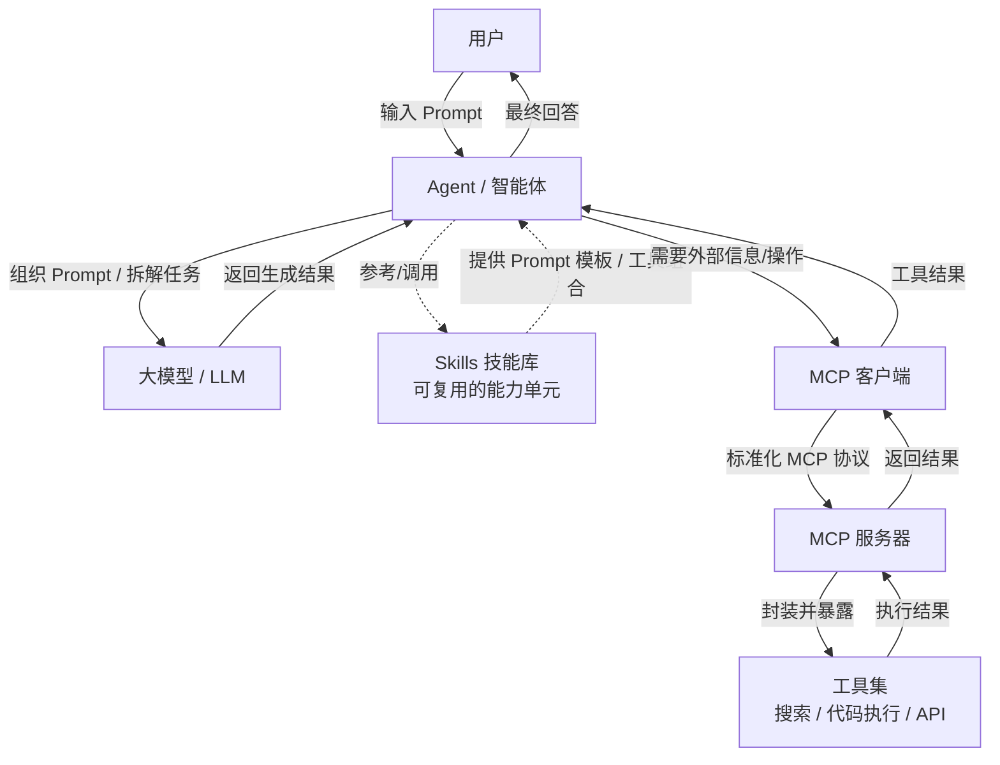
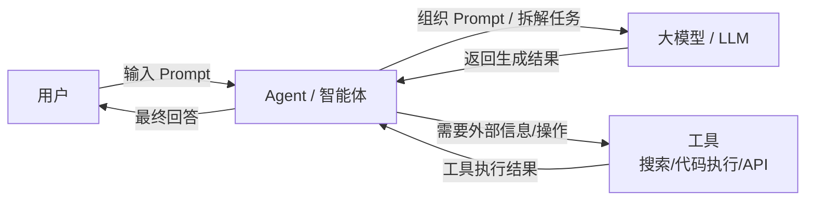

> **文档版本**：v1.2
> **更新日期**：2026-05-25
> **适用对象**：前端开发者
> **说明**：AI 编程实战指南，涵盖概念、原则、方法、技巧、工具与场景，帮助你系统化地用 AI 提升前端开发效率。

---

# 一、准备

## 几个基本概念

+ **大模型 / LLM**：在海量数据上训练的语言模型，能理解和生成文本、代码，是 AI 编程的"大脑"。
+ **Agent / 智能体**：以大模型为核心，配备工具和记忆，能自主规划并执行多步任务的系统。
+ **Prompt / 提示词**：你发给模型的输入文本——问题、指令或示例。Prompt 的质量直接决定输出质量。
+ **Token / 词元**：模型处理文本的最小单位，可以是一个词、一个字或一个字符。模型按 Token 计数，上下文窗口和 API 费用都基于 Token 计算。
+ **上下文窗口 / Context Window**：模型单次能处理的 Token 上限。超过上限，旧信息会被遗忘或截断。

> 想深入理解这些概念的能力边界、选型逻辑和常见误区，请跳到 [附录：AI 编程认知校准](#附录ai-编程认知校准)。

---

## 进阶概念

### 1. Skills（技能）

Skills 是赋予 AI Agent 的**可复用、模块化的能力单元**。一个 Skill 封装了完成特定任务所需的指令、知识、工具调用甚至示例。Skills 让 Agent 的能力**可组合、可共享**。

### 2. MCP（Model Context Protocol，模型上下文协议）

MCP 是一种**开放标准协议**，由 Anthropic 提出，旨在统一大模型与外部工具、数据源之间的连接方式。通俗理解：就像给 AI 配上"USB-C 接口"，任何工具只要实现 MCP，就能被 LLM 直接"即插即用"。

> 想看前端示例、架构图和与既有概念的关系，请跳到 [附录：Skills 与 MCP 深入](#skills-与-mcp-深入)。

---

# 二、道

> 大模型本质上就是**"高级概率接龙"**——基于上文 token 序列计算下一个 token 的概率。
> 它最擅长的是**"猜"**，因此要尽可能避免 AI 猜测意图。
>
> **减少随机性，增加确定性，压缩模型的"猜测空间"**。

---

## 核心原则

### 不猜测 + 主动提问（总纲）

> "不要猜测我的意图，不明确的地方必须向我提问。"

有经验的开发者最容易犯的错误是默认 AI 能猜到自己的意图。AI 不会拒绝你，但会"自行脑补"。主动提问是压缩猜测空间的第一道防线。

**前端示例**：
+ "你希望这个 Modal 是全局唯一的，还是每个页面独立实例？"
+ "表格的排序是前端假排序，还是调后端接口？"
+ "你项目的 Element Plus 主题色是自定义的，还是默认？"

### 具体 ✅ / 模糊 ❌

> ❌ "帮我优化这个组件"
>
> ✅
> "这个商品列表组件渲染 10000 条数据时滚动掉帧，帧率不足 30fps。
> 目标：稳定 60fps，首屏渲染 ≤1 秒。
> 方案限制：可用虚拟滚动、图片懒加载、Web Worker 处理数据，但不能改组件的 props 和 slot 接口。
> 技术栈：Vue 3 + Vite + Element Plus。"

### 约束 ✅ / 自由 ❌

> ❌ "给请求加个缓存"
>
> ✅
> "给 `fetchUserProfile` 请求加前端缓存。
>
> + 用内存 Map，不引入第三方库
> + TTL 5 分钟，过期自动重新请求
> + 不要影响其他 API 函数的调用方式
> + 不要新增项目依赖"

### 分步 ✅ / 一次 ❌

> ❌ "重构整个用户状态管理模块"
>
> ✅
> "重构用户状态管理（Pinia），分三步走：
> 第一步：梳理当前 store 中的所有状态、更新逻辑和跨组件依赖，列出来让我确认。
> 第二步：给出 2-3 种重构方案（拆分为多个 store、引入组合式函数等）并对比优劣。
> 第三步：确认方案后再动手改代码。现在先做第一步。"

### 示例 ✅ / 描述 ❌

> ❌ "统一处理 API 错误"
>
> ✅
> "封装一个 `request` 函数，所有错误统一返回以下格式：
> ```json
> { "code": number, "message": string, "data": null }
> ```
> 并在响应拦截器中对 401 统一跳转登录页，其他错误统一 toast 提示（使用 Element Plus 的 `ElMessage`）。"

### 参考 ✅ / 从零开始 ❌

> ❌ "写一个新页面"
>
> ✅
> "参考 `src/views/Dashboard/index.vue` 的布局结构、数据请求封装和组件拆分方式，新建 `src/views/Settings/index.vue`。
> 路由命名、错误处理、响应式适配风格都要和 Dashboard 保持一致。"

---

## 其他

+ **一切问题问 AI（以下的观点同样可问AI进行解释）**
+ **凡是 AI 能做的，就不要人工做（token/经济允许的情况下抉择）**
+ **目的主导**：开发过程中的一切动作围绕"目的"展开
+ **上下文是 vibe coding 的第一性要素，垃圾输入，垃圾输出**
+ **系统性思考**：实体、链接、功能/目的，三个维度
+ **数据与函数即是编程的一切**
+ **输入、处理、输出刻画整个过程**
+ **多问 AI：是什么？为什么？怎么做？**
+ **先结构，后代码**：一定要规划好框架，不然后面技术债还不完
+ **奥卡姆剃刀定理：如无必要，勿增代码**（❗规则和上下文文档同样适用）
+ **帕累托法则**：关注重要的那 20%
+ **逆向思考**：先明确你的需求，从需求逆向构建代码
+ **重复**：多试几次，实在不行重新开个窗口
+ **专注**：极致的专注可以击穿代码，一次只做一件事（神人除外）

---

# 三、法

## 从直接写代码到文档驱动

### 承认现状：先写代码也没问题

有经验的开发者习惯了"想到哪里写到哪里"，直接把需求翻译成代码。这种模式在用 AI 编程时仍然走得通，但效率上限很低——AI 会频繁猜测你的意图，生成方向偏了就要重来。

### 最小切换路径：任务卡片

不需要从需求文档→设计文档→规格文档全套开始。开始任何 AI 任务前，先用 5 句话写一个**任务卡片**：

```
目标：一句话描述要做什么
输入：涉及哪些文件/接口/上下文
约束：技术栈是什么，不能动什么
验收：怎么判断做完了
参考：项目中有没有类似的代码
```

这个任务卡片可以直接写在 Prompt 开头，也可以存为 `docs/task.md` 让 AI 反复引用。

### 什么时候需要完整文档

| 任务规模 | 文档策略 |
|---|---|
| 修改一个组件 / 修复一个 Bug | 一条清晰指令即可 |
| 开发一个中等功能（1-2 天） | 任务卡片 + 设计文档 |
| 跨模块重构（3 天+） | 需求文档 → 规格文档 → 设计文档全套 |

### 文档为什么有效：5 个核心洞察

#### 1. 把模糊需求变成"施工图纸"

AI 不会拒绝你，但会"自行脑补"——只说"做一个登录页"，它可能随便给个默认样式、缺失验证逻辑、路由也不对。
**文档显式化**：

+ **具体**：页面分几部分？数据怎么来？状态有哪些？
+ **约束**：技术栈是什么？不引入什么库？兼容哪些浏览器？
+ **分步**：先做静态结构 → 再接 API → 最后加交互。
+ **示例**：接口返回格式、错误码映射。
+ **参考**：项目中已有的类似页面。

#### 2. 降低 AI 的"幻觉"

复杂任务（多个文件、状态管理、路由设计）时，文档作为**约束围栏**，**告诉 AI 什么能做、什么不能碰**。
例如："只能用已安装的依赖"、"不能改变现有 API 签名"。

#### 3. 文档是 AI 的"共享记忆"

大模型没有真记忆。把文档直接贴进 Prompt，或让 AI 先完善文档再执行，即使对话断掉，拿这份文档给另一个 AI 实例也能继续干。

#### 4. 把一次性"生成"变成可迭代的"工程"

1. 你写文档（或 AI 辅助写）
2. AI 根据文档生成代码
3. 你验收 → 发现问题
4. 更新文档 → AI 重新调整代码

这比在聊天窗口反复改 Prompt 高效得多。

#### 5. 天然适配 Agent 化

Agent 会把复杂任务拆解成多步，文档就是这些步骤的"施工计划"。
例如："先改 User 模型 → 再改 Service 层 → 最后更新 Controller，并保证单元测试通过"。

> **一句话总结**：结构化文档是唯一能让大模型稳定、可控、高质量完成复杂前端任务的"指令格式"。

---

## 需求文档

### 来源1：来自 PRD / 用户故事

直接复制 PRD 关键段落，让 AI 提取前端功能点。

### 来源2：自己写 + AI 讨论

**模板示例**（需求文档放在 `docs/proposal.md`）：

```markdown
# 需求文档：商品详情页性能优化

## 目标
解决商品详情页在低端机滚动卡顿、图片加载慢的问题。

## 输入
- 现有页面路径：`src/views/ProductDetail/index.vue`
- 商品数据接口：`GET /api/product/{id}` 返回 10+ 张高清图、规格参数、推荐商品
- 技术栈：Vue 3 + Vite + Pinia + Element Plus

## 输出要求
- 首屏加载时间 ≤ 1.5s（目前 4s）
- 滚动帧率 ≥ 50fps（目前 25fps）
- 不能改变对外路由参数格式

## 验收标准
1. 在 Chrome 低端模拟 (4x slowdown) 下测试通过
2. Lighthouse 性能分 ≥ 80
3. 无新增 ESLint 错误
```

### 使用 Skill（头脑风暴）

> 输入："用 brainstorming skill 分析商品详情页的性能瓶颈，输出设计规格，不写代码。"

AI 会输出：

+ 当前瓶颈点（图片未懒加载、组件未拆分、重复请求）
+ 优化方案对比
+ 推荐方案 + 理由

---

## 设计文档 / 规格文档

在文档驱动开发中，**设计文档**和**规格文档**经常被混用，但它们的侧重点不同：

| 维度 | 设计文档 (Design Doc) | 规格文档 (Spec Doc) |
| --- | --- | --- |
| **目标** | 描述"怎么做"——技术方案、架构、组件划分、数据流 | 描述"做什么"——功能行为、输入输出、边界条件、验收标准 |
| **读者** | 开发人员（含 AI） | 产品、测试、开发（含 AI） |
| **内容** | 组件职责、技术选型、API 设计、状态管理、错误处理策略 | 功能点列表、用户交互流程、输入输出示例、异常情况定义 |
| **产出物** | 代码结构、类/函数签名、模块依赖图 | 测试用例、验收清单、用户手册 |
| **变化频率** | 技术实现调整时变化 | 需求变更时变化 |

**简单理解**：

+ 规格文档 = **"要造一个什么样的椅子"**（材质、尺寸、承重要求）
+ 设计文档 = **"用什么样的榫卯结构、用什么工具、分几步做"**

在实际项目中，两者可以合并为一个文档，也可以在 `docs/` 目录下分开存放。**AI 编程时，规格文档用于明确"对错"，设计文档用于指导"实现"**。

---

### 设计文档示例（侧重技术方案）

```markdown
# 设计文档：商品详情页虚拟滚动改造

## 数据流
- 页面组件 `ProductDetail/index.vue` → 调用 `useProductData` 组合式函数 → 返回 `{ product, loading, error }`
- 规格参数和评论区域使用 `VirtualScroller` 组件

## 组件职责
| 组件名 | 职责 | Props |
|--------|------|-------|
| ProductGallery | 图片画廊 + 缩略图 | images[], currentIndex |
| SkuSelector | SKU 规格联动 | skuList[], onSelect |
| VirtualScroller | 虚拟滚动容器 | items[], itemHeight, buffer |

## 技术约束
- 必须复用现有 `request` 工具
- 不引入新的 UI 库（继续使用 Element Plus）
- 样式用 SCSS + CSS Modules，不写全局样式

## 错误处理
- 接口失败显示骨架屏 + 重试按钮
- 图片加载失败显示默认占位图
```

---

### 规格文档示例（侧重行为与验收）

```markdown
# 规格文档：商品详情页性能优化

## 功能行为
1. **页面加载**
   - 进入页面时，优先展示骨架屏（高度与真实内容一致）
   - 商品主图区域先显示占位色块，图片加载完成后淡入
   - 规格参数、评论区域在首屏外懒加载（滚动到附近时再请求）

2. **滚动行为**
   - 当评论超过 50 条时，自动启用虚拟滚动，只渲染可视区域 ± 5 条
   - 滚动帧率始终不低于 50fps（Chrome 性能面板验证）

3. **错误与降级**
   - 若商品主图加载失败，显示 Element Plus 的 `ElImage` 默认 error slot 内容
   - 若规格参数接口超时（>3s），重试一次，仍失败则显示"加载失败，点击重试"按钮

## 输入 / 输出
| 输入 | 输出 |
|------|------|
| 用户访问 `/product/123` | 页面渲染完成，LCP ≤ 1.5s |
| 用户滚动到评论区域 | 评论数据请求发出，加载指示器出现 |
| 网络断开 | 显示全局错误提示（ElMessage），不崩溃 |

## 验收标准（可量化）
- [ ] 在 Chrome DevTools 设置 CPU 4 倍降速、Fast 3G 网络下，LCP ≤ 1.5s
- [ ] 滚动时 FPS 连续 10 秒最低不低于 50fps（通过 `requestAnimationFrame` 埋点）
- [ ] 图片懒加载触发后，Network 面板可见图片请求在滚动时才发出
- [ ] 无控制台报错（`npm run build` 后预览测试）
```

---

> **使用建议**：
>
> + 小需求（1-2 人天）可以只写设计文档，将规格描述放在设计文档的"验收标准"一节。
> + 大需求（跨模块、多迭代）建议分开：先用规格文档对齐需求，再用设计文档指导 AI 实现。

---

## 其他

+ **正交性**：功能不要太重复（这个分场景）
+ **能抄不写**：不重复造轮子，先问 AI 有没有合适的仓库，下载下来改
+ **一定要看官方文档**：把官方文档链接发给 AI（如通过 context7 工具），让 AI 直接读取官方文档内容，准确度远高于模型训练语料中的过时知识
+ **按职责拆模块**
+ **接口先行，实现后补**
+ **一次只改一个模块**
+ **文档即上下文，不是事后补**

---

# 四、术

## 任务文档

> AI 编程工具一次做好一个小任务的成功率远高于一次做一个大任务。

### 拆解原则（前端示例）

#### 每个任务应该是"原子操作"

❌ 太大："重构整个商品详情页"
✅ 合适：

+ 任务1：把商品详情的数据请求从多个独立 `fetch` 改成统一封装的 `request` 函数
+ 任务2：给商品图片画廊添加放大镜和缩略图切换交互
+ 任务3：把商品规格选择器（SKU 联动）抽出为独立组件 `SkuSelector.vue`
+ 任务4：统一商品详情接口的错误处理和骨架屏状态展示

#### 每个任务有明确的完成标准

❌ 模糊："优化打包速度"
✅ 明确：
"开发环境 Vite 冷启动时间从 8 秒降到 3 秒以内。

+ 跑 `pnpm build` 验证生产构建成功且包体积不增加 10% 以上
+ 跑 `pnpm lint` 和 `pnpm test` 确认无新增告警和失败用例"

#### 任务之间有清晰的依赖关系

+ 任务1：创建 `useCartStore`（Pinia store），定义数据结构和方法签名（独立，先做）
+ 任务2：实现购物车的加/减/删/选中等状态逻辑（依赖任务1）
+ 任务3：实现购物车列表 UI 组件（依赖任务2）
+ 任务4：实现购物车小徽章组件，显示在导航栏（依赖任务2）
+ 任务5：实现下单页面，读取购物车数据（依赖任务2）

> 任务3 和 4 可以并行，任务5 依赖它们完成后的联调。

### 任务文档模板（`docs/tasks.md`）

```markdown
# 任务列表：购物车模块开发

## 任务1：创建购物车 Store
- **文件**：`src/stores/cart.ts`
- **完成标准**：导出 `useCartStore`，包含 `items`、`addItem`、`removeItem`、`updateQuantity`
- **依赖**：无

## 任务2：实现加/减/删逻辑
- **文件**：`src/stores/cart.ts`（继续修改）
- **完成标准**：`addItem` 自动合并相同 SKU；`updateQuantity` 支持数量为 0 时删除
- **依赖**：任务1

## 任务3：购物车列表 UI
- **文件**：`src/views/Cart/index.vue`
- **完成标准**：展示商品图片、名称、单价、数量调节器、小计、全选/删除选中按钮
- **依赖**：任务2
```

---

## 执行

### 单 Agent 逐步执行

> "按 tasks.md 顺序执行任务1，完成后停下来让我确认。"

### 多 Subagent 并行

> "任务3和任务4相互独立，请启动两个 subagent 分别实现购物车列表 UI 和购物车徽章组件。"

---

## 审查与验证

**前端常用验证命令**（让 AI 自己跑）：

```bash
pnpm lint           # 检查代码规范
pnpm test           # 单元测试
pnpm build          # 生产构建
pnpm preview        # 预览产物
```

**审查 Checklist**（可让 AI 逐条确认）：

- [ ] 是否使用了项目已有的组件库（如 Element Plus），而不是自己造轮子？
- [ ] 响应式布局在 375px / 768px / 1920px 下是否正常？
- [ ] 是否对非空数据做了防御性判断（避免 `xxx is not defined`）？
- [ ] 是否处理了 loading / empty / error 三种状态？
- [ ] 是否引入了不必要的依赖（检查 `package.json` diff）？

---

## 上下文管理

> AI 编程工具的"智商"直接取决于上下文质量。给太少它不理解你的项目，给太多它反而变笨。

### 上下文是怎么工作的

所有 AI 编程工具都有一个**上下文窗口**（context window），即 AI 的"工作记忆"。

| 工具 | 上下文窗口 | 说明 |
| --- | --- | --- |
| Claude Code | 200K tokens | 约15万字，最大 |
| Cursor | 128K-200K | 取决于模型 |
| Copilot | 128K | 包含打开的文件 |
| Gemini CLI | 1M-2M | 最大，但太大也有问题 |
| Trae | 128K-200K | 支持项目规则文件 |

**关键认知**：不是越大越好。塞太多无关信息，AI 会"注意力分散"。

---

### 核心策略

#### 1. 精确喂入，不要全塞

❌ "看看整个 `src/` 目录帮我找 bug"
✅ "看 `src/services/auth.ts` 的 `refreshToken` 函数，用户反馈刷新后还是提示过期。也看 `src/middleware/auth.ts` 里怎么验证 token 的。"

---

#### 2. 长对话定期"刷新"

当你感觉 AI 开始"忘事"或"变笨"：

```bash
# Claude Code
> /clear    # 清除当前对话，开新的
> /compact  # 压缩当前对话上下文，保留关键信息（Claude Code 特有）

# 或者主动总结
> 我们刚才做了：创建了 useCartStore，实现了加/删/改数量逻辑。
> 现在继续做：实现购物车列表 UI（任务3）。
```

---

#### 3. 用文件传递上下文，不用对话

❌ 在对话里贴了 500 行代码让 AI 分析
✅ "读 `src/components/Table/index.vue` 第 100-150 行的 `handleSort` 函数"

---

#### 4. 最小上下文原则（经验开发者最易犯）

> 先给最少信息，不够再加，而不是先全塞再删。

有经验的开发者容易高估 AI 的注意力广度——以为给了所有文件 AI 就能全面理解。
实际上，塞入无关内容越多，AI 对关键信息的"注意力密度"就越低。

**两个判断标准**：
- 如果 AI 生成的代码里引用了你没提的项目约定，说明上下文不够，补充配置文件。
- 如果 AI 开始忽略你 Prompt 后半部分的要求，说明上下文过载，删减无关文件。

---

#### 5. 项目配置文件是最高效的上下文

每个工具都有项目配置文件，启动时自动加载。

**不同工具的约定文件**：
- **Claude Code**：项目根目录下的 `CLAUDE.md`
- **DeepSeek TUI**：项目根目录下的 `AGENTS.md` 或 `.deepseek/instructions.md`
- **Cursor**：`.cursorrules`
- **Trae**：创建项目规则文件
- **其他工具**：通常也有类似的项目指令文件

无论是哪种工具，核心思路一样——把项目技术栈、代码规范、常用命令固化到文件中，每次对话自动加载，省去重复说明。

**例如 Trae 规则文件的内容**：

```markdown
# 项目技术栈
- Vue 3 + TypeScript + Vite
- UI 库：Element Plus
- 状态管理：Pinia
- 样式：SCSS + CSS Modules

# 代码规范
- 组件必须用 <script setup> 语法
- API 请求统一放在 src/api/ 下
- 禁止使用 any
- 组合式函数命名以 use 开头

# 常用命令
- 开发：pnpm dev
- 构建：pnpm build
- 测试：pnpm test
```

写好配置文件 = 每次对话自动带上最关键的上下文。

##### 建议写入约定的 Agent 行为准则

> 以下四个原则不是编写规则文件的技巧，而是**建议你直接写入项目约定文件的行为准则**（如 `AGENTS.md` / `CLAUDE.md`）。写入后，AI 在每次对话中都会自动遵循这些约束。
>
> 起步时先写最核心的 3-5 条硬约束即可，**迭代式追加，不要一次性堆砌**。规则越多冲突概率越大，AI 行为越不可预测。定期审视，删除从未触发或已过时的规则。

| 原则         | 解决什么问题          |
| ---------- | --------------- |
| **编码前思考**  | 错误假设、隐藏困惑、缺少权衡  |
| **简洁优先**   | 过度复杂、臃肿抽象       |
| **精准修改**   | 无关编辑、触碰不应碰的代码   |
| **目标驱动执行** | 通过测试优先、可验证的成功标准 |

##### 行为准则详解

###### 1. 编码前思考

**不要假设。不要隐藏困惑。呈现权衡。**

LLM 经常默默选择一种解释然后执行。这个原则强制明确推理：

+ **明确说明假设**——如果不确定，询问而不是猜测
+ **呈现多种解释**——当存在歧义时，不要默默选择
+ **适时提出异议**——如果存在更简单的方法，说出来
+ **困惑时停下来**——指出不清楚的地方并要求澄清

###### 2. 简洁优先

**用最少的代码解决问题。不要过度推测。**

对抗过度工程的倾向：

+ 不要添加要求之外的功能
+ 不要为一次性代码创建抽象
+ 不要添加未要求的"灵活性"或"可配置性"
+ 不要为不可能发生的场景做错误处理
+ 如果 200 行代码可以写成 50 行，重写它

**检验标准：** 资深工程师会觉得这过于复杂吗？如果是，简化。

###### 3. 精准修改

**只碰必须碰的。只清理自己造成的混乱。**

编辑现有代码时：

+ 不要"改进"相邻的代码、注释或格式
+ 不要重构没坏的东西
+ 匹配现有风格，即使你更倾向于不同的写法
+ 如果注意到无关的死代码，提一下——不要删除它

当你的改动产生孤儿代码时：

+ 删除因你的改动而变得无用的导入/变量/函数
+ 不要删除预先存在的死代码，除非被要求

**检验标准：** 每一行修改都应该能直接追溯到用户的请求。

###### 4. 目标驱动执行

**定义成功标准。循环验证直到达成。**

将指令式任务转化为可验证的目标：

| 不要这样做... | 转化为... |
| --- | --- |
| "添加验证" | "为无效输入编写测试，然后让它们通过" |
| "修复 bug" | "编写重现 bug 的测试，然后让它通过" |
| "重构 X" | "确保重构前后测试都能通过" |

对于多步骤任务，说明一个简短的计划：

```plain
1. [步骤] → 验证: [检查]
2. [步骤] → 验证: [检查]
3. [步骤] → 验证: [检查]
```

强有力的成功标准让 LLM 能够独立循环执行。弱标准（"让它工作"）需要不断澄清。

---

### 常见问题

| 问题 | 原因 | 解决 |
| --- | --- | --- |
| AI 生成的样式完全不对 | 没告诉它用 SCSS 还是 CSS Modules | 在配置文件里写明样式方案 |
| AI 用了一个项目里没有的库（如 lodash） | 没给 `package.json` 上下文 | 让它先读 `package.json` 或明确"只能用已有依赖" |
| AI 生成的 Element Plus 组件用法过时 | 版本不匹配 | 在配置里写明 `element-plus: ^2.7` |
| AI 忘了之前的约定（如禁止 `any`） | 早期消息权重降低 | 把重要约定放在规则文件里 |
| AI 编造不存在的 API 路径 | 没给路由文件或 swagger 文档 | 让它先 `grep` 搜索项目里的 API 调用 |
| 给了全部源码 AI 还是搞错了方向 | 上下文过载，AI 注意力被无关代码稀释 | 先只给核心文件参考，不够再加 |
| 想全面理解再动手，结果哪个都没做好 | 一次喂入太多职责不同的文件 | 拆成原子步骤，每步只给最相关的 1-2 个文件 |

##### 约定文件的规则冲突模式

当约定文件的规则逐渐增多时，可能引入三种隐式冲突，导致 AI 行为异常或不可预测：

| 冲突类型 | 表现 | 示例 |
| --- | --- | --- |
| **指令冲突** | 两条规则在同一场景给出相反的指引 | "多用组合式函数" vs "保持简单直接" |
| **优先级冲突** | 没有明确优先级，AI 无法判断哪条优先 | "安全优先" vs "性能优先" |
| **范围冲突** | 规则覆盖范围重叠，AI 不确定用哪个 | "所有 API 要有错误处理" vs "不要过度设计" |

**关键**：每加一条新规则，与已有规则做一次冲突检查。必要时给规则标注优先级（如 `[优先]` / `[兜底]`），或合并已有规则。

---

# 五、器

IDE、终端、模型、工具以及其他资源。

## 我的工具

以 **Claude Code** 为主力，负责深度思考、复杂逻辑实现、整体架构与长文本代码生成。

以 **Trae** 为辅助，负责快速自动补全、细节打磨、语法规范与工程化效率提升。

| 任务 | 用 Claude Code | 用 Trae |
| --- | :---: | :---: |
| 项目初始化 / 搭架子 | ✅ | |
| 架构设计 / 重构 | ✅ | |
| 写测试 / 跑测试 | ✅ | |
| Bug 调试（需要看日志） | ✅ | |
| 日常编码 / 新功能实现 | | ✅ |
| UI 调整 / 样式修改 | | ✅ |
| 代码理解 / 学习 | | ✅ |
| 小范围修改（改个参数、加个字段） | | ✅ |

---

## 工具选型建议

对于没有 Claude Code 订阅或偏好多工具协作的开发者，以下决策维度可供参考：

| 选型维度 | 优先考虑 | 备选方案 |
|---|---|---|
| 偏好的 IDE | VS Code → Cursor / Copilot / Continue | JetBrains → AI Assistant |
| 预算受限 | Cursor Free 额度 / GitHub Copilot 免费版 | ChatGPT Web + 手动复制代码 |
| 需要深度长上下文 | Claude Code（付费） | DeepSeek（大窗口 + 低成本） |
| 快速原型 / 日常编码 | Trae / Cursor | Windsurf / Codeium |
| 团队协作 | GitHub Copilot | Cursor Business |

**经验建议**：不必追求"最好的工具"。选一个能融入你现有工作流的工具，先用起来，等遇到瓶颈再换。切换工具的成本远低于"完美选型"的成本。

---

# 六、场景举例

## 场景一：Claude Code + Trae 协作开发 Vue 新功能

**目标**：后台 Vue 项目开发**订单批量导出导入功能**，Claude Code 做架构设计和代码骨架，Trae 做页面、样式、业务逻辑落地。

### 第一步：Claude Code 做架构设计（只出文档不写代码）

```plain
需求：Vue后台系统新增订单导入导出功能，支持CSV/Excel文件、按时间+订单状态筛选、大文件分片上传/流式导出、前端进度条展示。
技术栈：Vue3 + TS + Element Plus + xlsx + vite。

分析需求，输出到 docs/design/vue-order-import-export.md：
1. 前端页面结构（导入弹窗、导出筛选栏、进度提示）
2. 组件拆分设计（上传组件、导出筛选组件、进度弹窗组件）
3. Pinia状态管理设计（导入导出全局状态、加载状态）
4. 接口请求封装、文件分片逻辑、Excel/CSV库技术选型
5. 表单校验、异常提示、兼容低版本浏览器方案

只写设计文档，不写任何Vue代码。
```

### 第二步：Claude Code 生成 Vue 代码骨架

```plain
按 docs/design/vue-order-import-export.md 生成Vue项目代码骨架：
- src/views/order/OrderImportExport.vue 主页面
- src/components/order/ImportUpload.vue 分片上传组件
- src/components/order/ExportFilter.vue 导出筛选组件
- src/composables/useOrderFile.ts 导入导出通用逻辑
- src/stores/pinia/orderFile.ts 全局状态仓库

每个文件只写Vue组件结构、TS类型定义、接口签名和TODO注释，不实现具体业务逻辑。
严格使用Vue3 setup语法糖、Element Plus组件规范，类型定义完整适配Trae IDE补全。
```

### 第三步：切 Trae 填充实现细节

在 Trae 中打开骨架文件，AI 编辑框输入指令落地业务：

```plain
@OrderImportExport.vue 按TODO完成页面布局、Element Plus组件适配、样式美化
@useOrderFile.ts 实现文件分片上传、Excel解析、流式导出逻辑
@docs/design/vue-order-import-export.md 严格遵循设计文档
使用xlsx处理表格，大文件分片每批1000条，添加加载状态、错误弹窗提示，适配Vue3响应式规范。
```

### 第四步：回 Claude Code 做校验、审查

```plain
Trae已完成Vue功能开发，现在你来审查校验：
1. 跑 pnpm run typecheck、pnpm run lint 把报错列出并修复
2. 按前端代码审查五维度：安全 > 组件规范 > 性能 > 可维护性 > 代码风格
3. 检查是否和docs设计文档对齐、Vue组件拆分是否合理、有无冗余代码
4. 检查Element Plus样式兼容性、响应式适配、TS类型是否严格
```

**分工原则**：Claude Code 负责 Vue 架构、规范把控、全局设计；Trae 负责页面可视化开发、组件实现、样式调试、业务逻辑落地；最后回归 Claude 做代码质量闭环。

---

## 场景二：用 Claude Code 重构 Vue 耦合严重业务模块

**目标**：把臃肿耦合的**支付弹窗 + 支付逻辑模块**拆分为组件化、可复用、低耦合结构，分三步走防止 AI 乱改代码。

### 第一步：先摸清现状（只分析不改代码）

```plain
读 src/views/payment/、src/stores/pinia/payment.ts、src/utils/payment/ 下所有Vue/ts文件，做三件事：
1. 画出组件嵌套、Pinia状态、工具函数调用关系
2. 列出当前问题：组件臃肿、逻辑和视图耦合、重复支付校验、无类型约束、缺少组件单测、样式全局污染
3. 不要改任何代码，分析结果输出到 docs/vue-payment-refactor.md
先做，做完等我确认。
```

### 第二步：要方案，不要代码

```plain
基于上面的Vue支付模块分析，给出2个重构方案。
每个方案说清楚：
- 核心思路（一句话，遵循Vue3组合式API+单一职责）
- 改动范围（哪些Vue组件、Pinia文件、工具文件会动，估算代码行数）
- 优缺点各2-3条（组件复用性、维护成本、迁移难度）
- 风险点（页面兼容性、旧逻辑兼容、样式冲突）

不要开始写代码，等我选方案。
```

### 第三步：按方案分步执行，Claude 把控节奏、Trae 落地

```plain
按方案1重构，分四个阶段做，每个阶段完成后暂停：
① 抽取通用支付基础组件（BasePayModal、PayMethodItem）
② 拆分业务支付页面，剥离核心逻辑到composables组合式函数
③ 重构Pinia支付仓库，拆分模块化状态管理
④ 统一支付工具函数，补充TS类型定义

要求：
- 每个阶段完成后跑 pnpm run typecheck、pnpm run lint 校验语法规范
- 每个阶段commit一次，commit message清晰标注Vue组件/文件改动
- 有Vue语法、组件拆分、TS类型疑问先问我再改
- 拆分后严格遵循Vue3 setup语法糖、组件命名规范
```

**关键控闸**：第一步不改动代码、第二步只出方案、第三步分阶段暂停，杜绝 AI 一次性乱改整个 Vue 模块。

---

## 场景三：给老旧 Vue 项目补组件 / 工具测试

**目标**：无测试的老 Vue3 项目，用 AI 快速提升单元测试覆盖率，适配 Vitest + Vue Test Utils。

### 一次性完整指令

```plain
给 src/views/、src/components/、src/composables/、src/utils/ 下Vue项目代码补充测试，按优先级顺序做：
优先级：
1. 核心业务组件：订单、支付、登录权限相关Vue页面/组件
2. 通用基础组件：弹窗、表单、分页、上传公共组件
3. 工具函数/组合式函数：utils通用方法、composables复用逻辑

每个文件固定流程：
1. 先读Vue/TS代码，列出关键渲染逻辑、交互事件、边界条件，输出checklist
2. 我确认checklist后，再编写测试用例
3. 采用Vitest + Vue Test Utils，测试文件放在 __tests__/ 目录，命名为 xxx.test.ts
4. 组件测试测渲染、事件触发、props传参；工具函数测正常/异常/边界入参
5. 每个文件测完跑 pnpm run test 确认通过，逐个commit，标注新增测试文件

质量要求：
- 覆盖率目标80%，Vue组件私有方法、简单静态模板不强制测试
- 测组件行为和业务逻辑，不mock所有内部依赖
- 必测边界：空数据渲染、超长文本、异常接口返回、表单非法输入、组件插槽传参

现在从 src/components/ 通用基础组件开始逐个补测试。
```

---

## AI 常见问题 & 打断话术

| AI 异常症状 | 直接打断话术 |
| --- | --- |
| Vue 测试全是过度 mock，没真实渲染组件 | 这些 Vue 组件测试 mock 太多，改成真实挂载渲染，测组件交互和渲染结果 |
| 逐行测试 Vue 私有方法、模板静态内容 | 只测 Vue 公开 props、事件、业务逻辑，私有方法和纯静态模板不用单独写测试 |
| 测试报错、Vue 语法告警直接忽略 | 跑 pnpm run test 把 Vitest 报错、Vue 语法警告贴出来，先修复再继续补测试 |
| 一次性修改多个 Vue 组件、乱改目录结构 | 停，先把当前单个 Vue 组件测试跑通，不许改动其他组件和项目目录 |

## 通用万能打断话术（随时可用）

```plain
停，先别写Vue代码。把你的重构/开发计划、组件拆分思路说一遍，我确认后再继续。
```

```plain
扔掉当前Vue重构方案，按Vue3组合式API规范重新设计组件拆分逻辑。
```

```plain
只改当前这一个Vue/ts文件，不要新增依赖、不要改动路由和Pinia全局仓库。
```

```plain
跑一下pnpm run typecheck和pnpm run lint，把TS类型错误、ESLint规范问题贴出来分析，不要自行猜测修改。
```

```plain
给我3个Vue组件重构可能的风险点和排查方法，我确认后再动手改代码。
```

---

## 场景四：用 AI 做日常代码审查

**目标**：写完代码后让 AI 快速审查，避免自己 review 时遗漏明显问题。

```plain
我刚改完 src/views/OrderList/index.vue，diff 如下。
按以下维度审查，只输出发现的问题和修改建议，不要夸"做得好"：

1. 安全：XSS、CSRF、敏感信息泄露
2. 边界：空数组、null 数据、字段缺失时会不会报错
3. 性能：有无不必要的重复渲染、大循环、重复请求
4. 风格：是否和项目现有代码风格一致
5. 依赖：是否引入了新依赖、是否必要

只说问题，不说优点。
```

**经验**：代码审查是经验开发者最容易从 AI 编程中立即获得价值的场景——不需要改变现有工作流，写完代码后多花 2 分钟让 AI 审一遍，经常能发现"这个空数组会报错"、"这个接口没做 loading 状态"之类的人工容易漏掉的问题。

## 场景五：用 AI 辅助重构不愿手写的旧模块

**目标**：面对一个逻辑混乱、不敢动的旧模块，让 AI 帮你分析并规划重构路径。

```plain
读 src/utils/priceCalculator.ts 全部内容，做三件事：

1. 用一句话概括这个模块的核心职责
2. 列出当前代码中所有的问题点（逻辑错误、重复代码、命名混乱、缺少类型）
3. 给出 2 种重构方案，每种说清楚改动范围和风险

不要动手改代码，分析结果输出到 docs/refactor-priceCalculator.md。
我确认方案后再开始动手。
```

**关键控闸**：和场景二一样——"只分析不改代码"和"要方案不要代码"这两道闸门对老项目重构尤其重要。AI 一旦开始改老代码，破坏范围往往超出预期。

---

# 七、高阶功法

## [OpenSpec](https://github.com/Fission-AI/OpenSpec)

+ **定义**：一种**自然语言即规格**的轻量框架，允许你用 Markdown 文档直接定义前端组件的行为、状态流转、事件响应。由 Fission-AI 开源，旨在实现规范驱动开发（Spec-driven Development）。
+ **用途**：通过在代码编写前定义清晰的规格，降低 AI 的猜测空间，让 AI 生成更精准的代码。支持从规格文档自动生成单元测试或 E2E 测试脚本。
+ **前端场景**：
  - 用 Markdown 描述表单组件的校验规则、交互状态，让 AI 直接生成符合规格的 Vue 组件代码。
  - 在开发前定义页面状态流转图，AI 自动生成 Pinia store 中的状态机逻辑。
  - 规格文件同时作为测试用例的输入，确保实现与需求对齐。
- [中文文档](https://lzw.me/docs/OpenSpec-Docs-zh/#overview)

## [superpowers](https://github.com/obra/superpowers)

+ **定义**：一组预制的 AI **Prompt 技能包**，例如"代码拆分专家"、"性能审计员"、"无障碍审计员"。每个技能包封装了特定领域的最佳实践和指令。
+ **用途**：一键激活专业角色，让 AI 在特定维度上进行深度分析和优化，不需要每次手写复杂的提示词。
+ [中文版](https://github.com/jnMetaCode/superpowers-zh)
+ **前端场景**：
  - 一键对当前页面做 Lighthouse 分析并给出修复建议。
  - 激活"无障碍审计员"技能，检查 Vue 组件的 ARIA 标签、键盘导航、对比度等问题。
  - 激活"性能审计员"技能，分析大列表渲染、打包体积、请求瀑布等性能瓶颈。

## [GSD（Get Shit Done）](https://github.com/gsd-build/get-shit-done)

+ **定义**：一个开源的 AI 编程 CLI 工具（GitHub: gsd-build/gsd-2），采用多 Agent 架构和原子任务拆分策略，解决 AI 长对话中的"上下文腐化"问题。通过直接控制 Agent 会话、Git 工作流和文件系统，确保代码质量的一致性。
+ **用途**：将 AI 编程从一次性对话转化为可恢复、可验证、可审计的工程流程。自动拆解复杂任务，分步执行并验证每个阶段的输出。
+ **前端场景**：
  - 将一个大型 Vue 组件重构任务拆解为多个原子步骤，每步完成后自动提交 Git 并运行 lint/test 验证。
  - 批量生成前端页面时，GSD 自动管理各页面的依赖关系和执行顺序，避免上下文污染。
  - 配合 CI 流程，用 GSD 自动化处理前端项目的依赖更新、样式迁移、API 替换等重复性工程。

## caveman

+ **定义**：一种 AI 输出压缩技能（[GitHub: JuliusBrussee/caveman](https://github.com/JuliusBrussee/caveman)），通过让 AI 以"山顶洞人"式的极简风格输出，压缩 65%-87% 的 Token 消耗，同时保持技术精度不变。
+ **用途**：大幅降低 AI 回复中的客套话和冗余表述，让 AI 只输出有用的内容。信息密度越高，AI 的理解反而越精准。
+ **前端场景**：
  - 在处理大型前端仓库时启用 caveman 模式，AI 输出只包含关键代码 diff 和命令，省去解释性废话，极大延长有效上下文窗口。
  - 代码审查场景下，caveman 让 AI 只输出问题行和修复建议，不输出"看起来不错"之类的冗词。
  - 配合 /compact 使用，让长对话中的 AI 回复始终保持高信息密度。

## RTK

+ **定义**：一款开源的 CLI 代理工具（[GitHub: rtk-ai/rtk](https://github.com/rtk-ai/rtk)），运行在 AI 助手与开发工具之间，拦截 AI 执行的命令输出并自动过滤——移除进度条、重复信息、格式化噪音等冗余内容，只保留关键输出。单个 Rust 二进制文件，零依赖。
+ **用途**：在不改变工作流的前提下，将每次命令消耗的 Token 降低 60-90%，大幅延长 AI 有效上下文窗口，同时减少 API 费用。支持 Git、Cargo、JavaScript、Python、Go 等主流生态的命令过滤。
+ **前端场景**：
  - 在 AI 编程会话中执行 `git status` / `git diff` / `git log` 等操作时，RTK 将大量文件列表和状态信息压缩为精简摘要，节省 Token。
  - `npm install` / `pnpm install` 等包管理命令的输出包含大量进度条和依赖树，RTK 自动过滤掉无关行，只保留安装结果。
  - 用 `rtk gain` 查看每轮会话节省的 Token 量，用 `rtk discover` 发现尚未被 RTK 覆盖的命令，逐步完善过滤配置。
  - 配合 caveman 模式使用：caveman 压缩 AI 输出，RTK 压缩 AI 看到的命令输出，双端叠加节省上下文。

---

## 其他值得关注的框架/概念

+ **Vite + Vue 官方 AI 插件**：基于 Vite 的 AI 辅助配置生成。
+ **Browser Use**：让 Agent 像人类一样操作浏览器（点击、输入、截图）。
+ **AutoDev**：VS Code 插件，Agent 能直接读写文件、执行终端命令。

> 这些框架正在快速迭代，建议按需引入，不要为了"用 AI 而用 AI"。
>
> 遇到问题，寻找方案，运用工具，迭代更新。

---

# 附录：AI 编程认知校准

> 以下概念在第一章速览中提及，此处展开为面向经验开发者的进阶视角——
> 不解释"是什么"，而是讨论"怎么用""边界在哪""什么场景选什么"。

## Skills 与 MCP 深入

### Skills（技能）深入

+ **前端示例**
  - "表单校验 Skill"：包含常用的邮箱/手机号正则、错误提示风格、异步校验逻辑。
  - "API 请求 Skill"：封装了项目统一的 `request` 函数、鉴权 Header、错误处理 toast。
  - "组件生成 Skill"：给一段 UI 描述，自动按项目规范生成 Vue 组件文件（`<script setup>` 语法）。

+ **与既有概念的关系**
  Skills 在 Agent 框架中被定义和管理；内部会使用 Prompt 引导 LLM，也可能调用工具。它们让 Agent 的能力**可组合、可共享**。

### MCP（Model Context Protocol，模型上下文协议）深入

+ **前端示例**
  - 用 MCP 连接本地 `components.json` 文件，让 AI 自动知道项目已有的组件库。
  - 连接 Figma API，AI 能读取设计稿并生成对应 HTML/CSS。
  - 连接 Git 仓库，AI 可以直接分析 commit 历史、diff 内容来做代码审查。

+ **架构示意**



---

## 大模型的能力边界与选型

+ **基本认知**
  大模型（LLM）的本质是基于海量文本训练的概率模型，擅长模式匹配和语言生成，
  不擅长精确数学计算、多步严格逻辑推理、以及对实时数据的确证。

+ **前端视角能力分布**

  | LLM 擅长 | LLM 经常翻车 |
  |---|---|
  | 生成结构化代码（Vue SFC、CSS、TS 类型）| 需要精确数值计算（如价格汇总）|
  | 解释报错栈和日志 | 处理超长上下文中的细节一致性 |
  | 按示例风格续写代码 | 需要访问私有 API 或实时数据库 |
  | 翻译技术需求为代码实现 | 理解项目全局的隐式约束 |

+ **选型速查**

  | 需求场景 | 推荐倾向 | 原因 |
  |---|---|---|
  | 架构设计、复杂重构 | Claude Sonnet 4.6 | 长上下文下保持连贯性最好 |
  | 日常编码、快速原型 | GPT-5 | 速度优先，成本低 |
  | 代码审查、安全检查 | 多模型交叉验证 | 不同模型漏检模式不同 |
  | Token 敏感的大量文件处理 | Gemini 3.5 Pro（1M ctx）| 超大上下文窗口 |
  | 国内用户首选 / 低门槛 | DeepSeek V4 / GLM-5.1（智谱）| 无需网络工具，API 价格低 |
  | 长上下文 + 代码均衡 | KIMI K2.6（月之暗面）| 256K 上下文，前端代码理解较好 |

+ **Coding Plan 选型参考**

  Coding Plan 是云厂商推出的 AI 编程模型订阅套餐，固定月费提供大量请求额度，
  可在 Cursor / Claude Code / Cline / OpenClaw 等 AI 编程工具中使用。国内主流方案如下：

  | 厂商 | 月费（约） | 代表模型 | 特点 |
  |---|---|---|---|
  | 火山引擎方舟 | 40-200 元 | DeepSeek-V3.2、GLM-4.7、Kimi-K2 | 多模型聚合，Auto 自动选模型 |
  | 阿里云百炼 | 40-200 元 | Qwen3.5、GLM-5、MiniMax-M2.5 | Qwen 编程模型强，选择最多 |
  | 腾讯云 | 40-200 元 | 混元、GLM-5、Kimi-K2.5 | 企业生态好，首月有低价（7.9 元起）|
  | 百度千帆 | 39.9 元 | GLM-5、MiniMax-M2.5、文心系列 | 千帆生态，适合企业用户 |
  | Kimi Code | 49 元 | Kimi K2 / K2.5 | 长上下文，推理能力强 |
  | 智谱 GLM | 49 元 | GLM-4.7、GLM-5 | 推理强，Agent 生态完善 |
  | MiniMax | 29 元起 | MiniMax M2.7 | 极致性价比 |

  > Coding Plan 通常有使用限制（仅限 AI Coding 工具调用），且各厂商的模型和价格会频繁调整，订阅前请查阅最新官方文档。

## 从单轮到 Agent：什么时候放权

+ **基本认知**
  Agent = 大模型 + 工具 + 记忆 + 自主规划。它不是"更聪明的聊天框"，
  而是一个能自主执行多步任务的"虚拟工程师"。

+ **前端决策指南**

  | 场景 | 适合单轮对话 | 适合 Agent |
  |---|---|---|
  | 生成一个独立的 Vue 组件 | ✅ | |
  | 跨多个文件的新功能开发 | | ✅ |
  | 重构既有代码模块 | | ✅（分步控闸）|
  | 修复已知 Bug | ✅ | |
  | 自动化测试生成 | | ✅ |
  | 项目初始化搭架子 | | ✅ |

+ **经验提示**
  Agent 不是越自主越好。对于前期需求不明确的任务，先单轮对话对齐认知，
  再切换 Agent 执行。Agent 翻车时最常见的止损策略：**"停，先把当前改动的 diff 给我看"**。

## Prompt 的结构化模式与反模式

+ **基本认知**
  Prompt 不是"跟 AI 说话"，而是**给 AI 的指令规格**。
  好的 Prompt 降低 AI 的猜测空间，坏的 Prompt 放大幻觉。

+ **前端通用结构模板**

  ```markdown
  ## 目标
  [一句话描述要做什么]

  ## 输入
  - 涉及文件：[路径1]、[路径2]
  - 背景：[现状描述]

  ## 约束
  - 技术栈：[Vue3 + TS + Vite + Element Plus]
  - 不引入新的依赖
  - 不改动现有组件接口

  ## 输出要求
  - [具体可验收的结果]
  - [如果有输出格式，贴示例]

  ## 参考
  [项目中的类似文件或代码片段]
  ```

+ **常见反模式**

  | 反模式 | 问题 | 改进 |
  |---|---|---|
  | "帮我优化一下" | 优化目标、指标、范围全模糊 | 说明具体问题 + 期望指标 + 不动什么 |
  | "写一个完整的页面" | 容易一次生成大量未经对齐的代码 | 先出设计文档或结构骨架 |
  | "就像淘宝那样" | 依赖 AI 对"淘宝"的主观理解 | 贴具体的行为描述或截图 |
  | 在 Prompt 里塞了 20 个要求 | 注意力分散，后面的要求被忽略 | 拆成 2-3 个独立任务 |

## 上下文窗口的实战量化认知

+ **基本认知**
  上下文窗口是模型单次能处理的输入上限。不是越大越好——
  当真实有效信息被无关内容稀释时，模型表现会指数级下降。

+ **主流模型对比**

  | 工具 / 模型 | 上下文窗口 | 前端场景限制 |
  |---|---|---|
  | Claude Sonnet 4.6 | 200K tokens | 约一个中型项目的全部业务代码 |
  | Claude Opus 4.7 | 200K tokens | 同上，但处理长上下文更稳定 |
  | GPT-5 | 128K tokens | 小心大型组件文件撑爆 |
  | Gemini 3.5 Pro | 1M tokens | 可塞多个项目，但太长时注意力分散明显 |
  | DeepSeek V4 | 1M tokens | 适合大型代码库的全文分析 |
  | GLM-5.1（智谱）| 200K tokens | 国内直连，API 价格低，适合日常编码 |
  | KIMI K2.6（月之暗面）| 256K tokens | 长上下文支持好，前端代码能力较强 |
  | MiniMax M2.7 | 256K tokens | 性价比高，适合批量处理任务 |

+ **Token 量化参考（前端场景）**

  | 内容 | 约消耗 Tokens |
  |---|---|
  | 一个中等 Vue 组件（~200 行）| 2K - 3K tokens |
  | 一个页面 + store + 路由（~800 行）| 8K - 12K tokens |
  | 一个完整中台项目的前端代码 | 80K - 200K tokens |
  | 上述 + node_modules 塞进去 | 瞬间爆掉 |

+ **管理要点**
  - 关注**有效上下文占比**而非总窗口大小
  - 先给精确的文件引用，不够再补充——不要"保险起见全塞"
  - 长对话中定期使用 /compact 刷新
  - 将项目约定固化到配置文件中，而不是每次对话重复说

---

## Agent 工作流参考图

> 以下流程图展示了用户、Agent、LLM、工具之间的协作关系。


